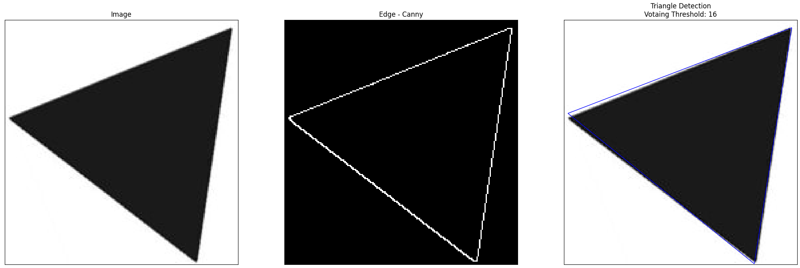

# ComputerVision
## Description
This repo contains homeworks done as part of the ImageProcessing course in Haifa University, Israel 
In order to receive the results for each HW, simply run script.m file

### HW 1
#### Hough-Transform
Using <b>Hough-Transform</b> and <b>Voting algorithm</b>, we detect equaliteral triangles by voating for the center and the angle of the triangle 

Detecting many triangles we receive many false-positive detection, which could be avoided by applying non-maximal-supression algorithm:

#### SIFT
Using <b>SIFT</b> we can find <b>Keypoints</b> and their <b>Descriptors</b> in images, and find matches between keypoints by descriptors distance using the following tests: 
1. Second closest match test
2. Dual match test

